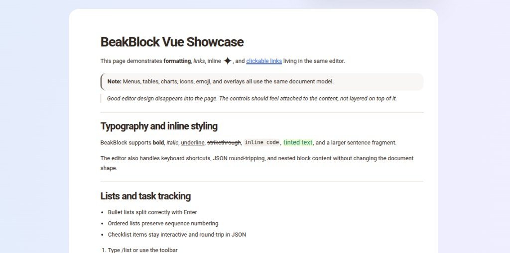

<p align="center">
  <h1 align="center">BeakBlock</h1>
  <p align="center">
    A block editor with a fully public ProseMirror API, shipped as Core, React, and Vue packages.
  </p>
</p>

<p align="center">
  
</p>
<p align="center">
  <sub>Screenshot from the Vite + Vue showcase (<code>examples/vite-vue</code>).</sub>
</p>

<p align="center">
  <a href="#what-you-get">What you get</a> •
  <a href="#installation">Installation</a> •
  <a href="#quick-start">Quick Start</a> •
  <a href="#ai-assistant">AI assistant</a> •
  <a href="#slash-commands-menu">Slash commands</a> •
  <a href="#examples">Examples</a> •
  <a href="#documentation">Documentation</a> •
  <a href="#packages">Packages</a>
</p>

---

## What BeakBlock Is

BeakBlock is a framework-agnostic rich text editor built on ProseMirror. It is designed for teams that want:

- direct access to the editor internals
- typed APIs instead of hidden implementation details
- a block-based document model
- React and Vue bindings over the same core
- built-in UI for menus, tables, media, charts, AI-assisted writing, comments, and custom blocks

Unlike editors that hide ProseMirror behind wrappers, BeakBlock exposes the editor state, view, document, and transaction layer directly through `editor.pm.*`.

```ts
editor.pm.view
editor.pm.state
editor.pm.dispatch(tr)
editor.pm.setNodeAttrs(pos, attrs)
```

## What You Get

- **Core editor package** with the ProseMirror schema, commands, plugins, and block model
- **React bindings** with hooks and components
- **Vue bindings** with composables and components
- **Built-in blocks** for headings, paragraphs, lists, checklists, code, tables, columns, images, embeds, icons, charts, and callouts
- **Built-in menus** for slash commands, bubble formatting, tables, media, and links
- **AI assistant** — slash command and bubble-menu entry, modal UI in React/Vue, document + selection context helpers, and curated presets in core
- **Comments** — `CommentModal` and bubble-menu hook for threaded discussions (see Vue/React examples)
- **Block JSON** that can be stored, transformed, and reloaded
- **Custom block support** for React and Vue
- **TypeScript-first APIs** across the workspace

## Installation

BeakBlock packages are published under the `@aurthurm` scope.

Add the GitHub Packages registry to your project `.npmrc`:

```ini
@aurthurm:registry=https://npm.pkg.github.com
```

Install the packages you need:

```bash
pnpm add @aurthurm/beakblock-core @aurthurm/beakblock-react @aurthurm/beakblock-vue
```

If you only want a single binding layer, install just the package you need.

## Quick Start

### React

```tsx
import { useBeakBlock, BeakBlockView, SlashMenu, BubbleMenu, TableHandles } from '@aurthurm/beakblock-react';

function Editor() {
  const editor = useBeakBlock({
    initialContent: [
      {
        id: '1',
        type: 'paragraph',
        props: {},
        content: [{ type: 'text', text: 'Hello, world!', styles: {} }],
      },
    ],
  });

  return (
    <>
      <BeakBlockView editor={editor} />
      <SlashMenu editor={editor} />
      <BubbleMenu editor={editor} />
      <TableHandles editor={editor} />
    </>
  );
}
```

### Vue

```vue
<script setup lang="ts">
import { useBeakBlock, BeakBlockView } from '@aurthurm/beakblock-vue';

const editor = useBeakBlock({
  initialContent: [
    {
      id: '1',
      type: 'paragraph',
      props: {},
      content: [{ type: 'text', text: 'Hello, Vue!', styles: {} }],
    },
  ],
});
</script>

<template>
  <BeakBlockView :editor="editor" />
</template>
```

Wire **SlashMenu**, **BubbleMenu**, **AIModal**, and **CommentModal** the same way as in [`examples/vite-vue`](examples/vite-vue) or [`examples/nuxt-vue`](examples/nuxt-vue): pass `@ai` / `@comment` handlers from the menus into your modals, and call your backend from the modal’s execute/apply callbacks.

### Vanilla JavaScript

```ts
import { BeakBlockEditor } from '@aurthurm/beakblock-core';

const editor = new BeakBlockEditor({
  initialContent: [],
});

editor.mount(document.getElementById('editor'));
```

> BeakBlock injects its base editor styles by default. If you want to supply your own stylesheet, set `injectStyles: false` in the editor config.

## AI assistant

BeakBlock treats AI as a first-class integration point: the core builds structured **context** (document markdown, block JSON, and optional selection), and the React/Vue packages ship an **AI modal** you can connect to any model or API.

### Where it appears

| Entry | What happens |
| --- | --- |
| **Slash menu** → **AI assistant** (`id`: `ai`) | Framework adapters emit an `ai` event (Vue) or you handle the menu (React) so you can open the modal in **slash** mode — tuned for continuing or restructuring from the cursor. |
| **Bubble menu** → sparkles (**AI**) | Shown when you pass `onAI`; opens the modal in **bubble** mode — tuned for rewriting the current text selection. |

The default slash item is a no-op at the ProseMirror layer on purpose; **React** `SlashMenu` and **Vue** `SlashMenu` detect the `ai` item and delegate to your handler.

### Core helpers and presets

From `@aurthurm/beakblock-core`:

- **`buildAIContext(editor, mode, preset?, instruction?)`** — builds `AIContext` with document blocks, derived markdown, and selection metadata when the selection is non-empty.
- **`BUBBLE_AI_PRESETS`** / **`SLASH_AI_PRESETS`** — opinionated starter prompts (titles, descriptions, and underlying instructions).
- **`getAIPresets(mode)`** — returns the preset list for the given entry mode.

**Bubble presets:** Improve writing, Fix grammar, Fix spelling, Simplify, Make shorter, Make longer.

**Slash presets:** Continue writing, Summarize, Add action items, Outline, Rewrite.

### `AIModal` (React and Vue)

Use **`AIModal`** from `@aurthurm/beakblock-react` or `@aurthurm/beakblock-vue`. Typical props:

- **`open`**, **`onClose`** — visibility
- **`editor`** — `BeakBlockEditor` instance
- **`mode`** — `'bubble' | 'slash'` (drives which preset list and context shape feel natural)
- **`presets`** — usually `BUBBLE_AI_PRESETS` or `SLASH_AI_PRESETS`, or your own array of the same shape
- **`onExecute`** — called with an `AIRequest`; run your model here and return text (see examples)
- **`onApply`** — insert or replace content in the document from the model output

The shared example helpers in [`examples/shared/ai.ts`](examples/shared/ai.ts) show how to:

- **`buildAIMessages`** — turn an `AIRequest` into chat messages (system + user) including preset, instruction, selection, markdown, and JSON blocks.
- **`runOpenAICompletion`** — call OpenAI-compatible chat completions using **`OPENAI_API_KEY`**, optional **`BEAKBLOCK_AI_MODEL`** (default `gpt-4.1-mini`), and optional **`BEAKBLOCK_AI_BASE_URL`**.
- **`sendAIRequest`** — POST JSON to your own route (e.g. `/api/ai`) for server-side keys.

### Comments

**`CommentModal`** works alongside **`BubbleMenu`**’s comment action (`onComment` / `@comment`). The Nuxt and Vite Vue demos wire both AI and comments end-to-end.

## Slash commands (`/` menu)

Type **`/`** at the **start of a block** to open the command palette. The query filters by **title** and **keywords** (case-insensitive). Items are grouped in the UI as below.

Default **`SlashMenuItem` `id` values** (for `hideItems`, `itemOrder`, or custom extensions):

### Basic blocks

| ID | Title | Notes |
| --- | --- | --- |
| `heading1` | Heading 1 | Large section heading |
| `heading2` | Heading 2 | Medium section heading |
| `heading3` | Heading 3 | Small section heading |
| `quote` | Quote | Blockquote |
| `calloutInfo` | Callout | Info-style callout |
| `calloutWarning` | Warning | Warning callout |
| `calloutSuccess` | Success | Success callout |
| `calloutError` | Error | Error callout |
| `codeBlock` | Code Block | Fenced-style code block |
| `divider` | Divider | Horizontal rule + new paragraph |

### Insert

| ID | Title | Notes |
| --- | --- | --- |
| `emoji` | Emoji | Opens emoji **picker** (`picker: 'emoji'`) |
| `icon` | Icon | Opens icon **picker** (`picker: 'icon'`) |

### AI

| ID | Title | Notes |
| --- | --- | --- |
| `ai` | AI assistant | Opens your AI flow (handled in React/Vue `SlashMenu`) |

### Lists

| ID | Title | Notes |
| --- | --- | --- |
| `bulletList` | Bullet List | Unordered list |
| `orderedList` | Numbered List | Ordered list |
| `checklist` | To-do list | Interactive checklist items |

### Layout

| ID | Title | Notes |
| --- | --- | --- |
| `columns2` | 2 Columns | Equal two-column layout |
| `columns3` | 3 Columns | Three-column layout |
| `columnsSidebar` | Sidebar Left | Narrow sidebar + main column |
| `table` | Table | 3×3 table |
| `table2x2` | Table 2x2 | 2×2 table |
| `table4x4` | Table 4x4 | 4×4 table |

### Media

| ID | Title | Notes |
| --- | --- | --- |
| `image` | Image | Image block |
| `embed` | Embed | Generic embed |
| `youtube` | YouTube | YouTube embed preset |

### Customizing the menu

- **`customItems`** — append commands (including AI or app-specific blocks).
- **`hideItems`** — pass item IDs to remove defaults (e.g. `youtube`, `columnsSidebar`).
- **`itemOrder`** — control which default items appear and in what order; IDs not listed are typically hidden — see package READMEs.

Custom blocks can register their own slash entries via **`createReactBlockSpec`** / **`createVueBlockSpec`**.

## Examples

The workspace includes two BeakBlock Vue demos:

```bash
pnpm --filter @aurthurm/beakblock-example-vite-vue dev
pnpm --filter @aurthurm/beakblock-example-nuxt-vue dev
```

The examples are intentionally dense and show:

- editorial page layout
- multi-column content
- tables and table actions
- charts
- images and embeds
- full slash menu (including **AI assistant**, emoji/icon pickers, and layout tables)
- bubble formatting and **AI** / **comment** actions
- **AIModal** with OpenAI-compatible or custom API wiring (`examples/shared/ai.ts`)
- **CommentModal** with threads and reactions
- inline icons and emojis
- links and colors

## Core API

### Document Operations

```ts
editor.getDocument()
editor.setDocument(blocks)
editor.getBlock(id)
editor.insertBlocks(blocks, ref, pos)
editor.updateBlock(id, update)
editor.removeBlocks(ids)
```

### Text Formatting

```ts
editor.toggleBold()
editor.toggleItalic()
editor.toggleUnderline()
editor.toggleStrikethrough()
editor.toggleCode()
editor.setTextColor(color)
editor.setBackgroundColor(color)
```

### Block Types

```ts
editor.setBlockType('heading', { level: 1 })
editor.setBlockType('codeBlock', { language: 'typescript' })
editor.setBlockType('bulletList')
editor.setBlockType('orderedList')
editor.setBlockType('blockquote')
editor.setBlockType('table')
```

### ProseMirror Access

```ts
editor.pm.view
editor.pm.state
editor.pm.doc
editor.pm.dispatch(tr)
editor.pm.setNodeAttrs(pos, attrs)
```

## Custom Blocks

BeakBlock supports custom blocks in both React and Vue.

- React: `createReactBlockSpec`
- Vue: `createVueBlockSpec`

Custom blocks can provide:

- node schema
- node view rendering
- slash menu entries
- update hooks
- custom props

See the full guide in [`docs/custom-blocks.md`](docs/custom-blocks.md).

## Documentation

| Guide | Description |
| --- | --- |
| [`docs/react-integration.md`](docs/react-integration.md) | React hooks, components, and integration patterns |
| [`docs/custom-blocks.md`](docs/custom-blocks.md) | Create custom block types |
| [`docs/custom-marks.md`](docs/custom-marks.md) | Create inline formatting marks |
| [`docs/plugins.md`](docs/plugins.md) | Build and extend ProseMirror plugins |
| [`docs/styling.md`](docs/styling.md) | Style the editor and its blocks |
| [`docs/collaboration.md`](docs/collaboration.md) | Use collaborative editing with Y.js |

## Packages

| Package | Description |
| --- | --- |
| [`@aurthurm/beakblock-core`](packages/core) | Framework-agnostic editor core |
| [`@aurthurm/beakblock-react`](packages/react) | React bindings and components |
| [`@aurthurm/beakblock-vue`](packages/vue) | Vue bindings and components |

## Repository Layout

- `packages/core` - schema, commands, plugins, editor core, and shared styles
- `packages/react` - React hooks and components
- `packages/vue` - Vue composables and components
- `examples/basic` - vanilla example
- `examples/vite-vue` - Vite + Vue showcase
- `examples/nuxt-vue` - Nuxt + Vue showcase
- `examples/shared` - shared demo helpers (AI message building, OpenAI client)
- `docs` - integration and customization guides

## GitHub social preview image

The showcase image used at the top of this README is committed as [`.github/beakblock-vue-showcase.png`](.github/beakblock-vue-showcase.png). To use it as the repository **Social preview** card on GitHub, open **Settings → General → Social preview** for the repo and upload that file (or the same asset from your machine). GitHub does not read the README image automatically for the social card.

## Development

```bash
pnpm install
pnpm build
pnpm test
pnpm dev
```

## Notes

- CSS is auto-injected by default in the editor core.
- The document model is block-based and serializable.
- React and Vue bindings are thin wrappers over the same ProseMirror core.
- The repository uses GitHub Packages for published artifacts.

## License

[Apache-2.0](LICENSE)
