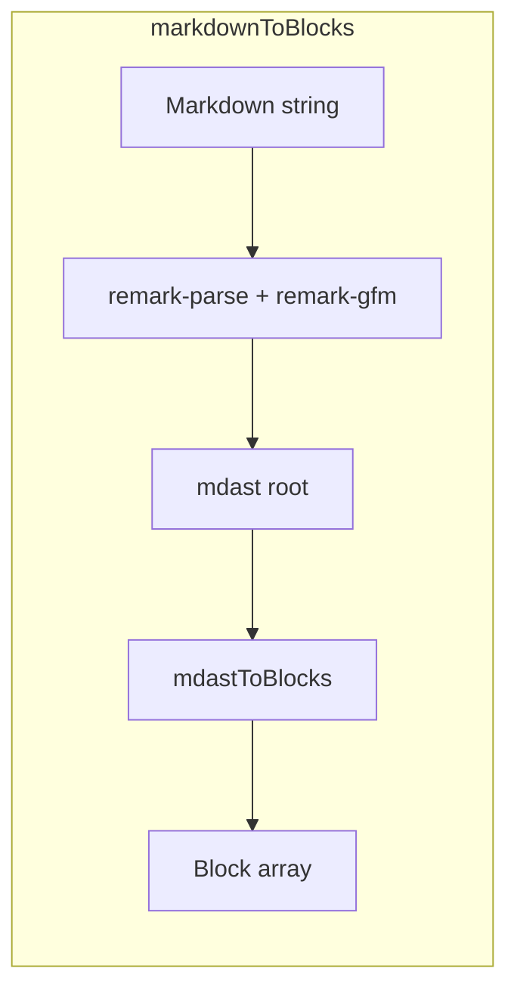
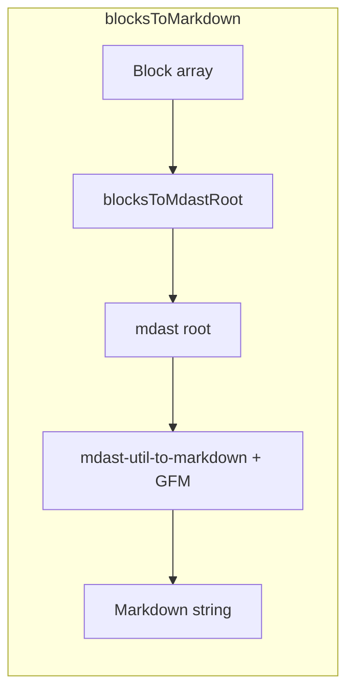

# Markdown import and export

BeakBlock supports three related paths for working with Markdown:

1. **Typing** — ProseMirror **input rules** turn patterns like `# ` or `**bold**` into nodes as you type (see [Input rules](#input-rules-vs-full-markdown)).
2. **Strings and files** — **`markdownToBlocks`** parses a full Markdown document into `Block[]` (for `setDocument`, persistence, or paste).
3. **Export** — **`blocksToMarkdown`** serializes `Block[]` back to a Markdown string (GFM-aware by default).

Clipboard **paste** can optionally treat plain-text clipboard data as Markdown when there is no HTML on the clipboard.

---

## Quick start

```typescript
import {
  BeakBlockEditor,
  markdownToBlocks,
  blocksToMarkdown,
} from '@aurthurm/beakblock-core';

// Load Markdown into the editor
const blocks = markdownToBlocks(`# Title\n\nHello **world**.`);
const editor = new BeakBlockEditor({
  element: document.getElementById('editor')!,
  initialContent: blocks,
});

// Or replace the document later
editor.setDocument(markdownToBlocks(await fetch('/doc.md').then((r) => r.text())));

// Export
const md = blocksToMarkdown(editor.getDocument());
```

---

## APIs (core)

| Function | Purpose |
|----------|---------|
| `markdownToBlocks(markdown, options?)` | `string` → `Block[]`. Options: `{ gfm?: boolean }` (default `true`; set `false` for CommonMark without GFM). |
| `blocksToMarkdown(blocks, options?)` | `Block[]` → `string`. Options: `{ gfm?: boolean }` (default `true`), `bullet?: '-' \| '*' \| '+'` (default `'-'`). |
| `looksLikeMarkdown(text)` | Returns whether plain text is likely Markdown (used for default paste behavior and for gating in your own UI). |
| `blocksToMdastRoot(blocks)` | Advanced: `Block[]` → mdast `root` if you want another serializer or tooling on the same tree. |
| `mdastToBlocks(root)` | Advanced: existing mdast `root` → `Block[]` (skip `remark` if you already parsed elsewhere). |
| `createMarkdownPastePlugin({ schema, mode })` | Build the paste plugin yourself when not using `createPlugins` / `BeakBlockEditor` defaults. |

Types are exported from `@aurthurm/beakblock-core` (`MarkdownParseOptions`, `MarkdownSerializeOptions`, `MarkdownPasteMode`, etc.).

---

## How parsing works (`markdownToBlocks`)

1. **Pipeline:** `unified().use(remarkParse)` and, unless `gfm: false`, `.use(remarkGfm)` parses the string into an **mdast** tree (CommonMark + GFM tables, task lists, strikethrough, autolinks).
2. **Mapping:** [`packages/core/src/markdown/mdastToBlocks.ts`](../packages/core/src/markdown/mdastToBlocks.ts) walks top-level mdast nodes and builds `Block` objects with new UUIDs:
   - `heading` → `heading` + `props.level`
   - `paragraph` → `paragraph` + `content`
   - `code` (fenced) → `codeBlock` + `props.language` + plain text in `content`
   - `blockquote` → merged inline (with `hardBreak` between original paragraphs) → `blockquote`, or **`callout`** if the first text matches `[info|warning|success|error|note]` (see fidelity below)
   - `list` with task items → `checkList` / `checkListItem` + `props.checked`
   - ordered / unordered lists → `orderedList` / `bulletList` + `listItem` (nested lists become `listItem.children`)
   - `table` (GFM) → `table` → `tableRow` → `tableHeader` / `tableCell` with `paragraph` children
   - `thematicBreak` → `divider`
3. **Inline content:** [`packages/core/src/markdown/phrasing.ts`](../packages/core/src/markdown/phrasing.ts) converts mdast phrasing (text, `strong`, `emphasis`, `delete`, `inlineCode`, `link`, `break`, …) into `InlineContent[]` with `TextStyles` and `link` nodes.



---

## How export works (`blocksToMarkdown`)

1. **Mapping:** [`packages/core/src/markdown/blocksToMdast.ts`](../packages/core/src/markdown/blocksToMdast.ts) turns each `Block` into mdast nodes under a `root` (e.g. `callout` → `blockquote` with a `[variant]` text prefix; lists and GFM task lists → `list` + `listItem` with `checked` when needed; tables → GFM `table` with `tableCell` children containing phrasing only).
2. **Stringify:** [`mdast-util-to-markdown`](https://github.com/syntax-tree/mdast-util-to-markdown) runs with [`mdast-util-gfm`](https://github.com/syntax-tree/mdast-util-gfm) when `gfm` is not `false`, so tables and task lists remain valid GFM.



---

## Clipboard paste (Markdown)

Implemented in [`packages/core/src/plugins/markdownPastePlugin.ts`](../packages/core/src/plugins/markdownPastePlugin.ts) and enabled by default when using [`createPlugins`](../packages/core/src/plugins/createPlugins.ts) / `BeakBlockEditor`.

**Behavior:**

1. If the clipboard includes **`text/html`**, the plugin does nothing — ProseMirror’s normal HTML paste runs.
2. Otherwise it reads **`text/plain`**.
3. If `markdownPaste` is `'heuristic'` (default), it parses only when [`looksLikeMarkdown`](../packages/core/src/markdown/heuristic.ts) returns true (fences, headings, list markers, blockquotes, task items, links, pipe-table-like lines, etc.).
4. If `markdownPaste` is `true`, every such plain-text paste is parsed as Markdown.
5. If `markdownPaste` is `false`, the plugin is not registered (or you omit it when building plugins).

On success, the selection is replaced with a slice built from `markdownToBlocks(text)` → `blocksToDoc(schema, blocks)` (same block→PM path as the rest of the editor).

### Editor configuration

```typescript
const editor = new BeakBlockEditor({
  element: el,
  initialContent: [],
  // Default: 'heuristic'
  markdownPaste: 'heuristic',
  // markdownPaste: true,   // always treat plain-text-only paste as Markdown
  // markdownPaste: false,  // disable Markdown paste
});
```

---

## Input rules vs full Markdown

| Mechanism | When | Scope |
|-----------|------|--------|
| **Input rules** | While typing; pattern + usually a trailing **space** or completed delimiter | Subset: `# `, `- `, `1. `, `> `, `` ``` ``, `---`, `**…**`, etc. See [`inputRules.ts`](../packages/core/src/plugins/inputRules.ts). |
| **`markdownToBlocks`** | Whole string, paste (plain text), or file load | CommonMark + GFM (tables, tasks, strikethrough, …) mapped to `Block[]`. |

Both produce the same underlying **block JSON** and ProseMirror schema; they are complementary.

---

## List items and nested content

`listItem` blocks may have inline `content` (first line) and block `children` (extra paragraphs, nested lists). When converting Markdown → blocks → ProseMirror, [`blockToNode`](../packages/core/src/blocks/blockToNode.ts) always creates a first **paragraph** from `content`, then appends nested block nodes so multi-paragraph list items round-trip correctly.

---

## Fidelity notes

### Well supported

Headings, paragraphs, thematic breaks, blockquotes, fenced code (`language` → `codeBlock.props.language`), bullet and ordered lists, GFM task lists, links, bold / italic / strikethrough (GFM) / inline code, GFM tables, and block-level images (as `image` where the pipeline emits them).

### Callouts

- **Export:** `callout` → Markdown blockquote whose first text is `[variant]` + body (`info` \| `warning` \| `success` \| `error` \| `note`).
- **Import:** blockquote whose merged inline content starts with that pattern → `callout` with `props.calloutType`.

### Lossy or simplified

- **Columns** (`columnList` / `column`): exported with simple separators; layout is not preserved as Markdown layout.
- **Table of contents:** placeholder text in Markdown.
- **Embeds:** link-style placeholder; not a full oEmbed representation.
- **Custom block types:** extend [`blocksToMdast.ts`](../packages/core/src/markdown/blocksToMdast.ts) / [`mdastToBlocks.ts`](../packages/core/src/markdown/mdastToBlocks.ts) in your app if you need first-class Markdown for them.
- **Colors, font size:** not part of standard Markdown; may be dropped or approximated.
- **Underline:** may appear as inline HTML in exported Markdown where needed.

Round-trip is **best-effort** for rich documents; treat Markdown as an interchange format, not a perfect clone of the JSON model.

---

## AI assistant

[`buildAIContext`](../packages/core/src/ai/context.ts) includes `document.markdown` and selection markdown derived from **`blocksToMarkdown`**, so AI features see the same serialization as your app.

---

## Word and PDF (examples, not core)

The core package does **not** bundle `.docx` or PDF libraries. The **React basic example** shows one pattern:

- [`examples/basic/src/exportOffice.ts`](../examples/basic/src/exportOffice.ts) — `downloadBlocksAsDocx` (using [`docx`](https://www.npmjs.com/package/docx)) and `printDocumentAsPdf` (`blocksToMarkdown` + [`marked`](https://www.npmjs.com/package/marked) + browser **Print** → “Save as PDF”).
- [`examples/basic/src/App.tsx`](../examples/basic/src/App.tsx) — toolbar actions: **Log MD**, **.docx**, **PDF**.

Reuse or adapt that module in your app; fidelity is intentionally simple (headings, paragraphs, lists, rough tables, etc.).

---

## Tests

[`packages/core/src/markdown/markdown.test.ts`](../packages/core/src/markdown/markdown.test.ts) covers parsing, export, and `looksLikeMarkdown`. Run from the core package:

```bash
pnpm --filter @aurthurm/beakblock-core test
```

---

## Related documentation

- Block JSON shapes: [`docs/blocks/README.md`](./blocks/README.md)
- Paragraph block and input-rule hints: [`docs/blocks/paragraph.md`](./blocks/paragraph.md)
